import { Notes, Appear } from '@mdx-deck/components'
import { Invert } from 'mdx-deck/layouts'
import { condensed as theme } from '@mdx-deck/themes'
import customTheme from './theme'

export const themes = [theme, customTheme]

# Control de versiones con Git

---

## ¡Hola!

|Iván López González <small><green>jlopez@suse.de</green></small>||David Díaz González <small><green>dgonzalez@suse.de</green></small>|
|-|-|-|

<strong>YaST</strong>

<small>the installation and configuration tool for openSUSE and the SUSE Linux Enterprise</small>

<a href="http://yast.opensuse.org"><small> http://yast.opensuse.org</small></a>

---

## Nuestro primer SCV: copias manuales

Periódicamente y/o antes de introducir nuevos cambios.

  <small>(localmente, en un dispositivo externo, Dropbox, Google Drive, etc)</small>

---

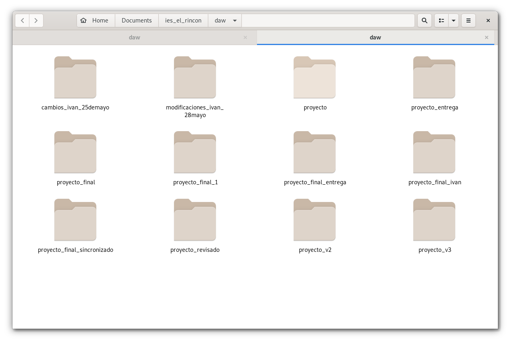

---

## ¿Problemas?

<ul>
  <Appear>
  <li>Ineficiente.</li>
  <li>Propenso a errores.</li>
  <li>Duplicidad innecesaria.</li>
  <li>No se registran los cambios o diferencias.</li>
  <li>Tampoco quién ni cuándo.</li>
  <li>Complica (muchísimo) el trabajo en equipo.</li>
  <li>...</li>
  </Appear>
</ul>

---

## Sistemas de control de versiones

> [...] <green>registra los cambios realizados</green> en un archivo o conjunto de archivos a lo largo del tiempo, de modo que puedas recuperar versiones específicas más adelante.
>
> [<small>Git Book - 1.1 Acerca del control de versiones</small>](https://git-scm.com/book/es/v2/Inicio---Sobre-el-Control-de-Versiones-Acerca-del-Control-de-Versiones)

---

## Sistemas de control de versiones

<ul>
  <Appear>
  <li>Diseñados para la gestión y el desarrollo de proyectos.</li>
  <li>Mantienen un histórico completo del proyecto.</li>
  <li>Permiten recuperar estados anteriores.</li>
  <li>Ver diferencias entre estados/versiones.</li>
  <li>Facilitan el trabajo en equipo.</li>
  </Appear>
</ul>

<Notes>
- Dan solución a todos esos problemas
</Notes>

---

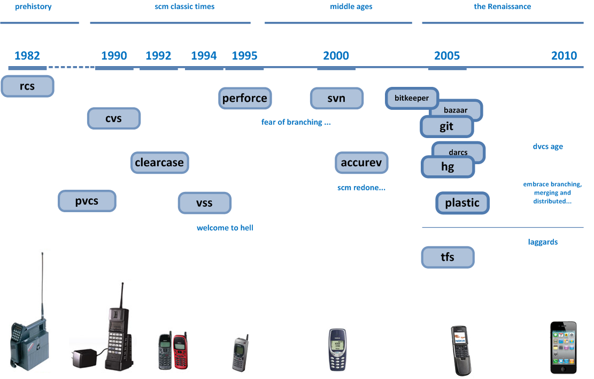
http://blog.plasticscm.com/2010/11/version-control-timeline.html

<Notes>
- Los más importantes
- Analogía con el desarrollo de la tecnología y complejidad de los proyectos
</Notes>

---

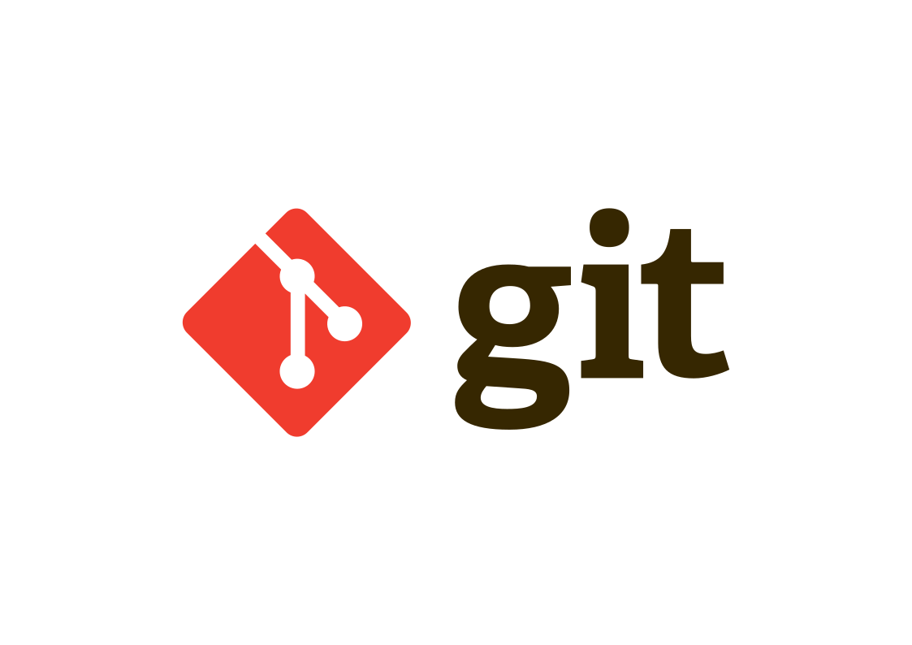

---

### ¿Por qué Git?

<ul>
  <Appear>
  <li>Es <em>open source</em>.</li>
  <li>Rápido y eficiente.</li>
  <li>El más usado<small> (según encuesta de StackOVerflow).</small></li>
  <li>El que nosotros usamos.</li>
  </Appear>
</ul>

---

https://insights.stackoverflow.com/survey/2018#work-_-version-control

---

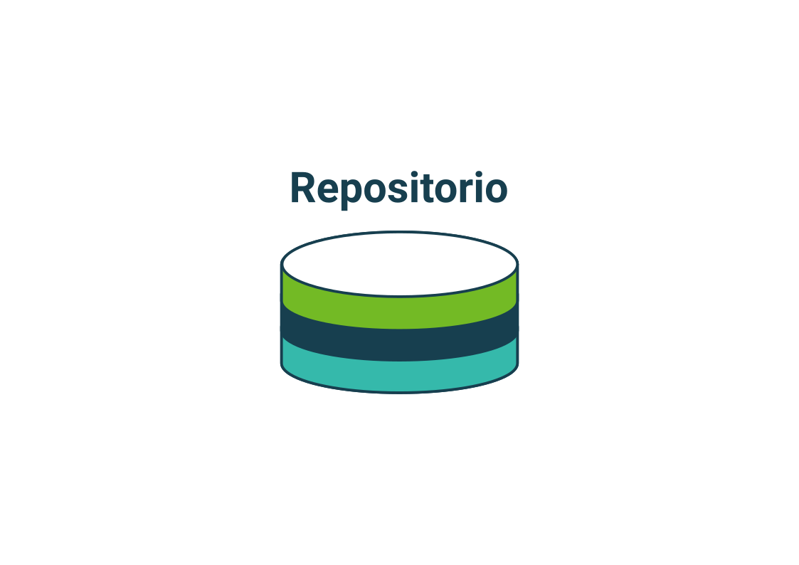

---

---

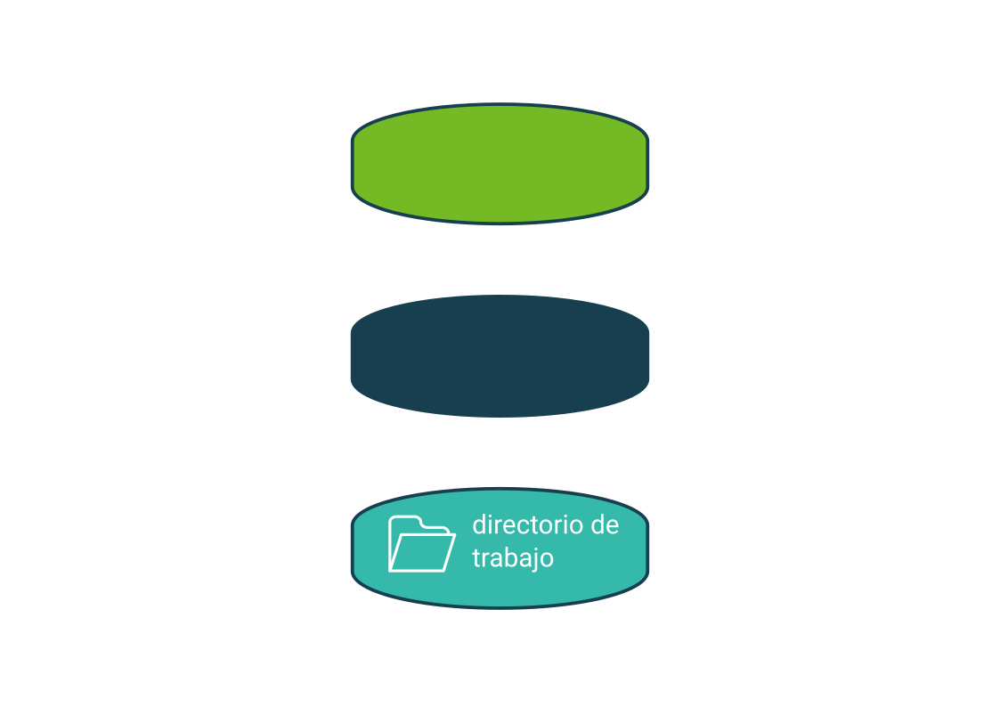

---

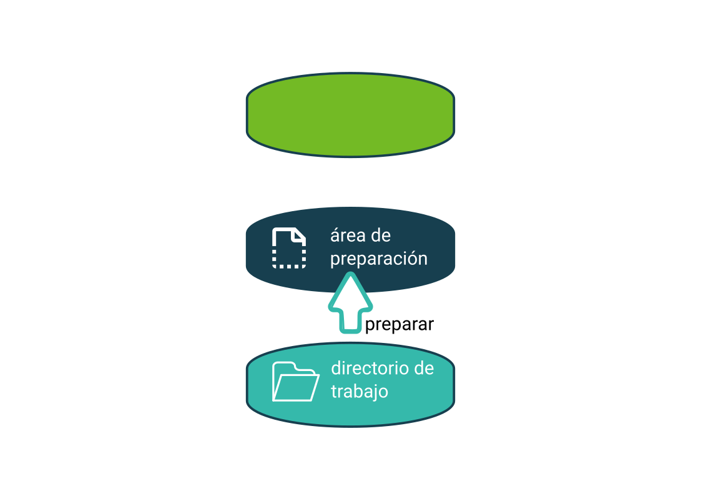

---

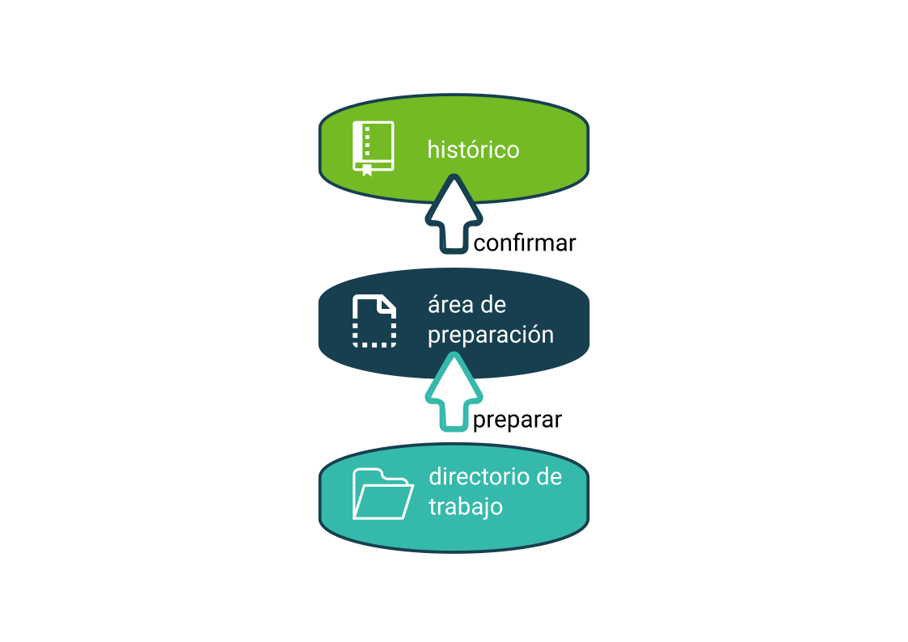

---

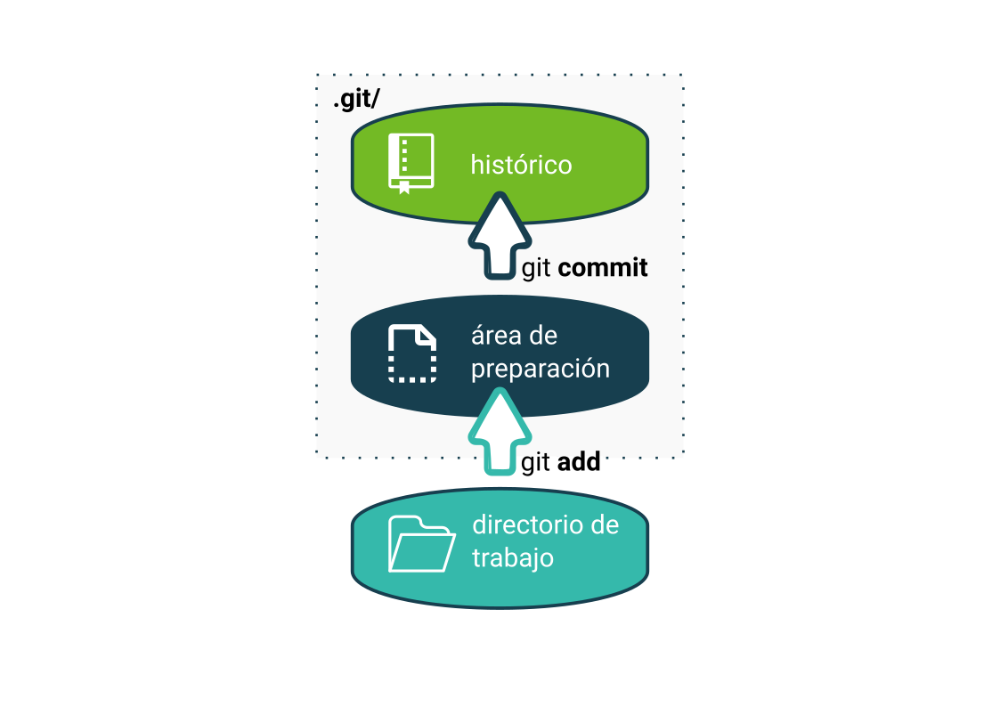

---

## Git es <em>distribuido</em>

* Cada colaborador tiene una copia completa del repositorio y su histórico.
* La mayor parte de las operaciones habituales se pueden hacer sobre la copia local.
* Sólo se necesita conexión a Internet (o una red local, según el caso) para "enviar" o "recibir" los últimos cambios a/desde cualquier copia accesible.

<Notes>
* Como efecto colateral, cada copia del repositorio es a su vez una copia de seguridad (que puede o no estar actualizada a los últimos cambios)
</Notes>

---

---

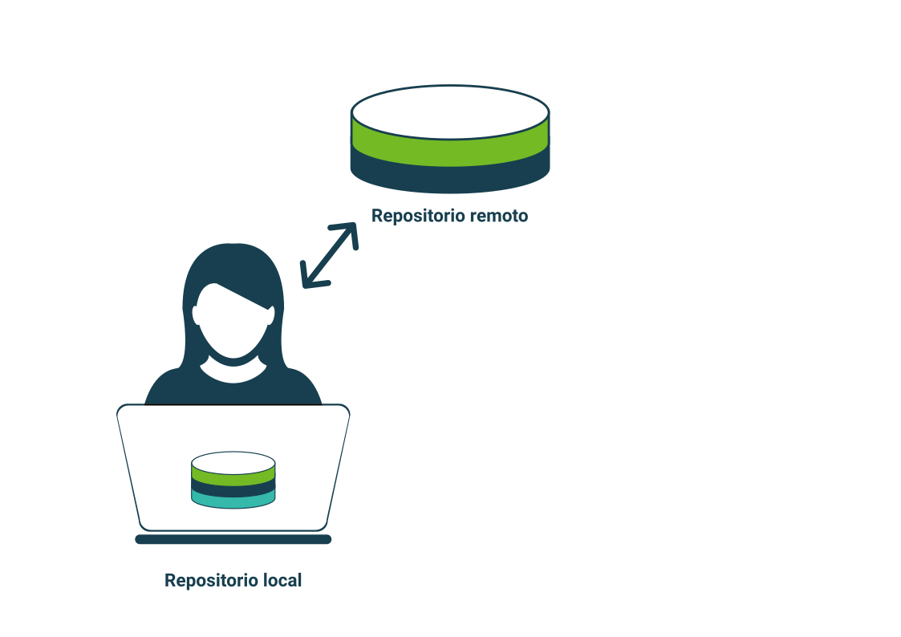

---

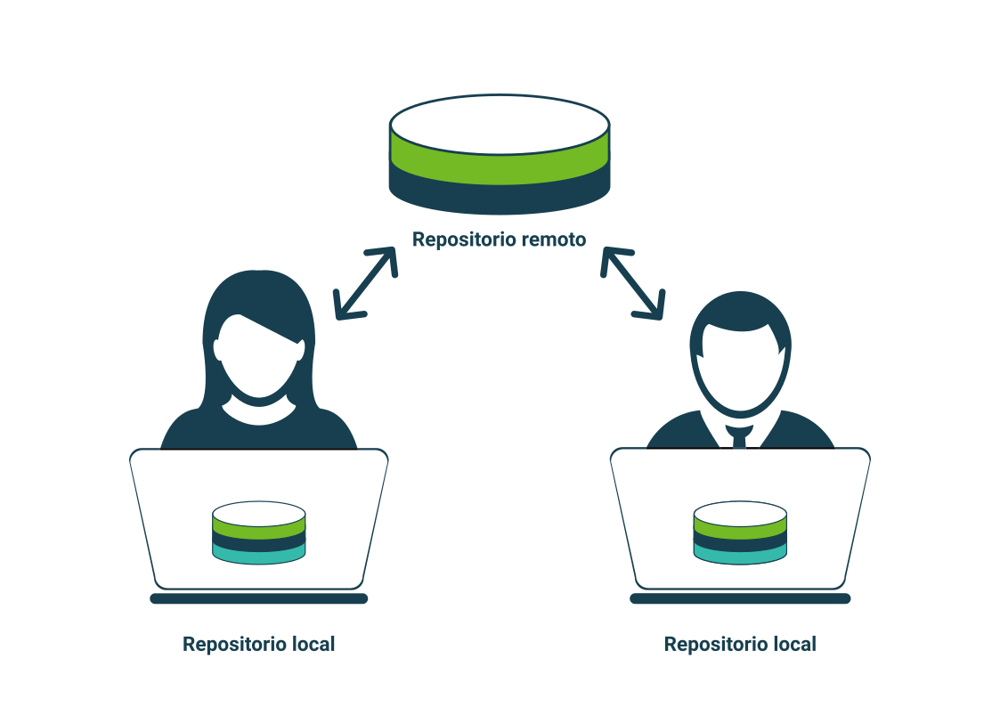

---

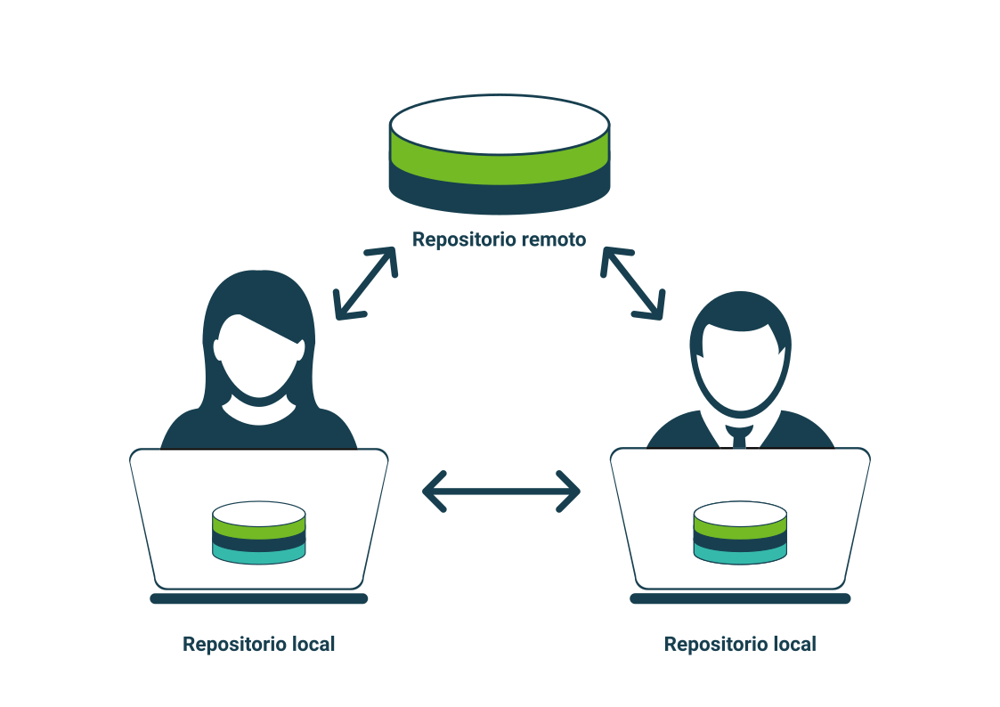

---

## Plataformas de desarrollo colaborativo

|  |  |  |
|--------|--------|-----------|
| GitLab | GitHub | Bitbucket |
| https://about.gitlab.com/ | https://github.com/ | https://bitbucket.org |

---

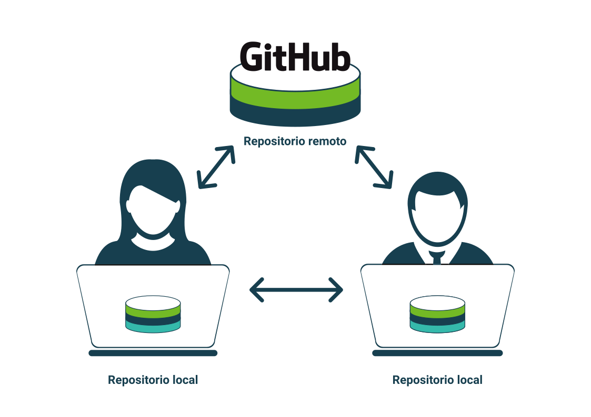

---

# Manos a la obra

---

## Instalación

### <b>:tada: ¡Ya incluido en `openSUSE`! :tada:</b>

Para la instalación en otras distribuciones de GNU/Linux u otros sistemas, [visitar la
documentación oficial](https://git-scm.com/book/es/v2/Inicio---Sobre-el-Control-de-Versiones-Instalaci%C3%B3n-de-Git)

---

#### Configuración básica

* `git config --global user.name 'Nombre'`
* `git config --global user.email 'email@ejemplo.com'`

---

#### Comandos básicos (para trabajar en local)

* `git init` <small>Inicializa un repositorio.</small>
* `git status` <small>Muestra el estado actual del repositorio.</small>
* `git add <fichero>` <small>Prepara fichero(s) modificados para ser confirmados.</small>
* `git commit` <small>Confirma los cambios generando, una entrada en el histórico.</small>
* `git log` <small>Muestra todos los <em>commits</em> que se han realizado.</small>
* `git diff` <small>Permite visualizar las diferencias entre el directorio de trabajo y el <em>área de preparación.</em></small>
* `git diff --cached` <small>Permite visualizar las diferencias entre el <em>área de preparación</em> y la última confirmación.</small>

#### Comandos básicos (para sincronizar con una copia remota)

* `git pull` <small>Actualiza la copia local con los cambios <em>recibidos</em> desde la copia remota.</small>
* `git push` <small>Actualiza la copia remota <em>enviando</em> los cambios disponibles en la copia local.</small>

---

# Recursos

Afortunadamente, hay una gran cantidad de recursos disponibles (la mayoría
gratuitos).

Algunas recomendaciones para empezar,

* La documentación de Git - https://git-scm.com/doc

  <small>Especialmente <a href="https://git-scm.com/book/en/v2">Pro Git book</a>, también <a href="https://git-scm.com/book/es/v2">disponible en español</a></small>

* [<em>git - the simple guide</em>](http://rogerdudler.github.io/git-guide)<small>, también</small> [<small>disponible en español</small>](http://rogerdudler.github.io/git-guide/index.es.html)

* Los tutoriales de

  * Atlassian Bitbucket - https://www.atlassian.com/git/tutorials

    <small>Bastante detallados e ilustrados.</small>

  * GitHub - https://guides.github.com

    [<small>Git Handbook</small>](https://guides.github.com/introduction/git-handbook/) <small>y</small> [<small>Hello World</small>](https://guides.github.com/activities/hello-world/) <small>pueden ser buenos puntos de partida.</small>

* [Domina Git desde cero](https://sargantanacode.es/course/mastering-git-from-scratchº) - <small>una serie de completos artículos en español</small>

* :film_frames: [Git tutorial](https://www.youtube.com/watch?v=9GKpbI1siow&list=PLpcSpRrAaOarEpNz71TSfNVd0eQmsZSgN)

* ...

---

## ¡Gracias!

### https://xkcd.com/1597
